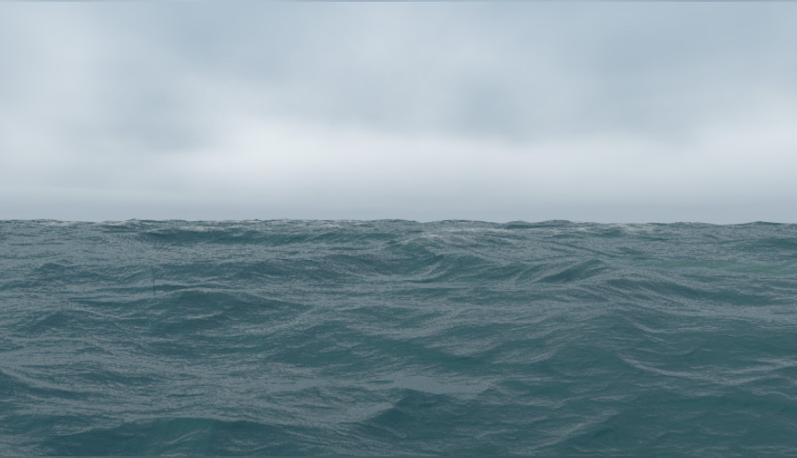

# Robinson

A real-time forward rendering framework for pedagogical purposes.

The renderer supports basic geometric primitives, a couple of basic shaders and is fairly extendable.

Currently, it targets modern web browsers using WebGL 2.0.

[Lame demo](http://davidyu.github.io/Robinson-web-samples/showcase/app.html)

[](http://davidyu.github.io/Robinson-web-samples/showcase/app.html)

[Slightly cooler demo](http://davidyu.github.io/Robinson-web-samples/sky/app.html)

[](http://davidyu.github.io/Robinson-web-samples/sky/app.html)

Thanks goes out to all authors of art assets used in this project.

With the exception of art assets, everything in this project is licensed under MIT:

```
The MIT License (MIT)

Copyright (c) 2015 - 2018 David Yu

Permission is hereby granted, free of charge, to any person obtaining a copy
of this software and associated documentation files (the "Software"), to deal
in the Software without restriction, including without limitation the rights
to use, copy, modify, merge, publish, distribute, sublicense, and/or sell
copies of the Software, and to permit persons to whom the Software is
furnished to do so, subject to the following conditions:

The above copyright notice and this permission notice shall be included in all
copies or substantial portions of the Software.

THE SOFTWARE IS PROVIDED "AS IS", WITHOUT WARRANTY OF ANY KIND, EXPRESS OR
IMPLIED, INCLUDING BUT NOT LIMITED TO THE WARRANTIES OF MERCHANTABILITY,
FITNESS FOR A PARTICULAR PURPOSE AND NONINFRINGEMENT. IN NO EVENT SHALL THE
AUTHORS OR COPYRIGHT HOLDERS BE LIABLE FOR ANY CLAIM, DAMAGES OR OTHER
LIABILITY, WHETHER IN AN ACTION OF CONTRACT, TORT OR OTHERWISE, ARISING FROM,
OUT OF OR IN CONNECTION WITH THE SOFTWARE OR THE USE OR OTHER DEALINGS IN THE
SOFTWARE.
```
